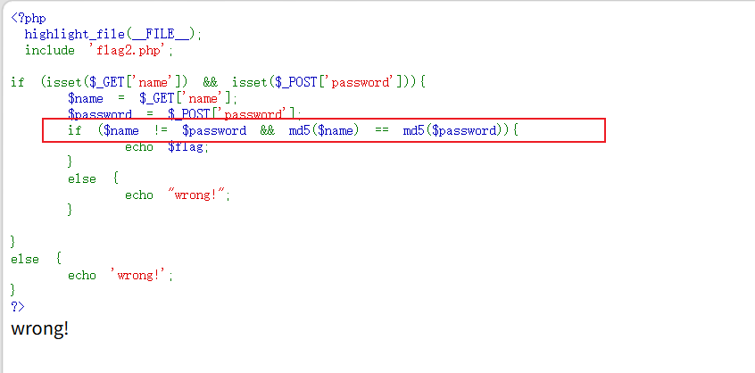
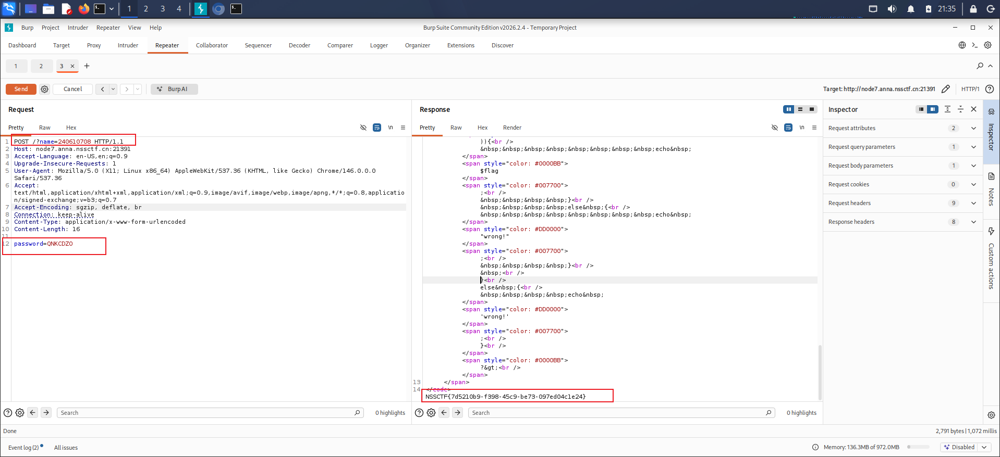

根据if ($name != $password && md5($name) == md5($password)) echo $flag;可知
需要利用 PHP MD5 弱类型比较漏洞
参数	位置	值	作用
name	URL Query	240610708	MD5值：0e462097431906509019562988736854
password	POST Body	QNKCDZO	MD5值：0e830400473942494202732019415327

