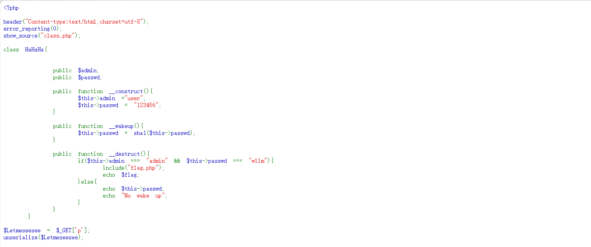
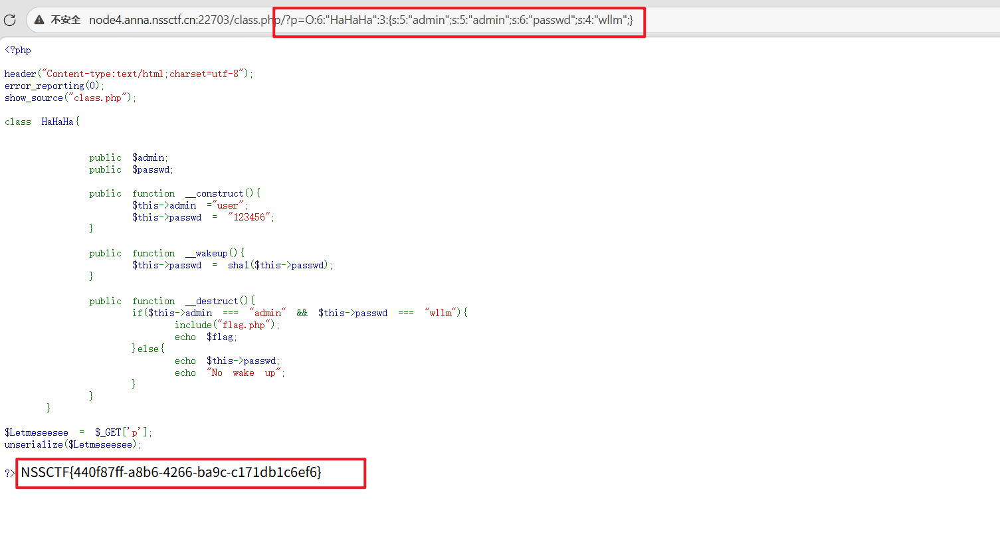

## 429[SWPUCTF 2021 新生赛]no_wakeup




当序列化字符串中代表属性的数字与实际属性个数不对应时，将会直接绕过__wakeup()方法。
```php
a:3:{s:4:"name";s:6:"张三";s:3:"age";i:25;s:8:"is_admin";b:0;}
```
例如：这里表示一个含有三个属性的数组，如果将a:3……改成a：2……将会直接绕过__wakeup（）方法。
